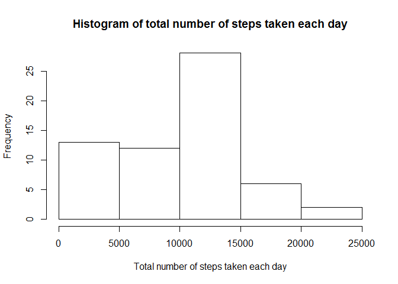
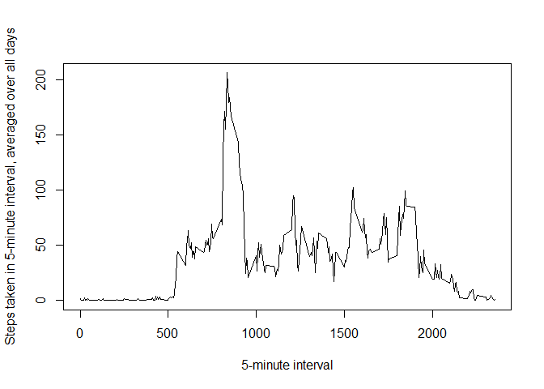
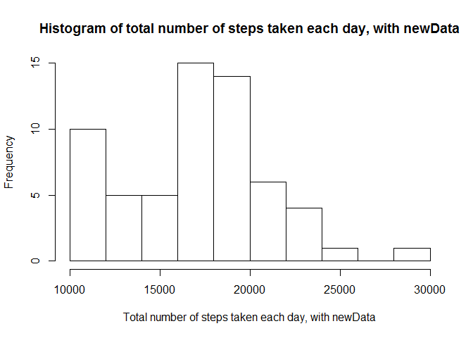
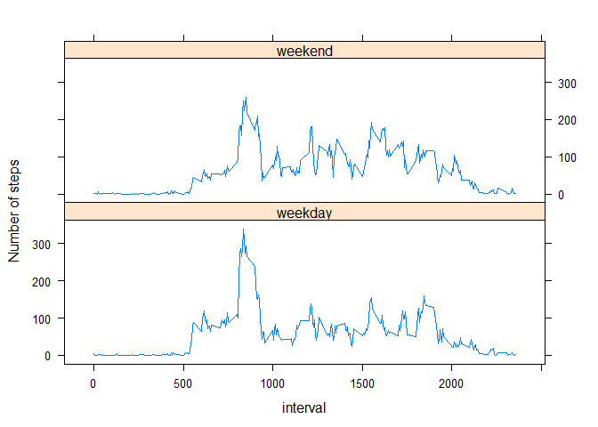

# Reproducible Research: Peer Assessment 1

##Preliminaries

Use the knitr package, set global options to echo \= TRUE. 


```r
library(knitr)

opts_chunk$set(echo=TRUE)
```

##Loading and preprocessing the data

Load the data into a variable called 'data'


```r
unzip("activity.zip")
data <- read.csv("activity.csv")
```

##What is mean total number of steps taken per day?

1. Calculate the total number of steps taken per day

We use the plyr's ddply command to find the total number of steps taken per day, and store in in a vector called 'sumOfSteps'


```r
library(plyr)
sumOfSteps <- ddply(data, .(date), summarize, sum=sum(steps,na.rm = TRUE))
head(sumOfSteps)
```

```
##         date   sum
## 1 2012-10-01     0
## 2 2012-10-02   126
## 3 2012-10-03 11352
## 4 2012-10-04 12116
## 5 2012-10-05 13294
## 6 2012-10-06 15420
```

2. Make a histogram of the total number of steps taken each day

```r
hist(sumOfSteps$sum, xlab = "Total number of steps taken each day", main = "Histogram of total number of steps taken each day")
```

 

3. Calculate and report the mean and median of the total number of steps taken per day


```r
meanSteps <- mean(sumOfSteps$sum)
medianSteps <- median(sumOfSteps$sum)

meanSteps
```

```
## [1] 9354.23
```

```r
medianSteps
```

```
## [1] 10395
```

The mean of the total number of steps taken per day is 9354.2295082 while the median is 10395.

##What is the average daily activity pattern?

1. Make a time series plot (i.e. type = "l") of the 5-minute interval (x-axis) and the average number of steps taken, averaged across all days (y-axis)

We first use the ddply function to find the average number of steps for each 5-minute interval, and store it in the vector 'averageOfSteps'.


```r
averageOfSteps <- ddply(data, .(interval), summarize, average=mean(steps,na.rm = TRUE))
head(averageOfSteps)
```

```
##   interval   average
## 1        0 1.7169811
## 2        5 0.3396226
## 3       10 0.1320755
## 4       15 0.1509434
## 5       20 0.0754717
## 6       25 2.0943396
```

Now, we make the plot.


```r
plot(averageOfSteps$interval, averageOfSteps$average, type = "l", xlab = "5-minute interval", ylab = "Steps taken in 5-minute interval, averaged over all days")
```

 

2. Which 5-minute interval, on average across all the days in the dataset, contains the maximum number of steps?

First we find the maximum number of steps


```r
maxSteps <- max(averageOfSteps$average, na.rm = TRUE)
maxSteps
```

```
## [1] 206.1698
```

Then we find the 5-minute interval corresponding to maxSteps


```r
maxInterval <- averageOfSteps$interval[match(maxSteps, averageOfSteps$average)]
maxInterval
```

```
## [1] 835
```

Thus the 5-minute interval 835 on average contains the maximum number of steps.

##Imputing missing values

1. Calculate and report the total number of missing values in the dataset (i.e. the total number of rows with NAs)

We simply use the is.na function to get a vector of TRUE/FALSE, and sum the values to get the number of rows with NAs


```r
totalMissingValues <- sum(is.na(data$steps))
totalMissingValues
```

```
## [1] 2304
```

There are a total of 2304 missing values.

2. Devise a strategy for filling in all of the missing values in the dataset. The strategy does not need to be sophisticated. For example, you could use the mean/median for that day, or the mean for that 5-minute interval, etc.

We shall use the mean for the 5-minute interval to replace missing values.

3. Create a new dataset that is equal to the original dataset but with the missing data filled in.

We use the pmax function with na.rm \= TRUE on the vectors data\$steps and averageOfSteps\$average so that when a value in data$steps is NA, the averageofSteps\$average value is returned. This is then stored in a new data set called newData.


```r
newData <- data
newData$steps <- pmax(data$steps, averageOfSteps$average, na.rm = TRUE)
head(newData)
```

```
##       steps       date interval
## 1 1.7169811 2012-10-01        0
## 2 0.3396226 2012-10-01        5
## 3 0.1320755 2012-10-01       10
## 4 0.1509434 2012-10-01       15
## 5 0.0754717 2012-10-01       20
## 6 2.0943396 2012-10-01       25
```

4. Make a histogram of the total number of steps taken each day and Calculate and report the mean and median total number of steps taken per day. Do these values differ from the estimates from the first part of the assignment? What is the impact of imputing missing data on the estimates of the total daily number of steps?

We repeat the analysis from the section "What is mean total number of steps taken per day?" on newData.


```r
newSumOfSteps <- ddply(newData, .(date), summarize, sum=sum(steps,na.rm = TRUE))
head(newSumOfSteps)
```

```
##         date      sum
## 1 2012-10-01 10766.19
## 2 2012-10-02 10878.87
## 3 2012-10-03 18820.72
## 4 2012-10-04 18309.25
## 5 2012-10-05 19198.96
## 6 2012-10-06 20944.17
```

```r
hist(newSumOfSteps$sum, xlab = "Total number of steps taken each day, with newData", main = "Histogram of total number of steps taken each day, with newData")
```

 

```r
newMeanSteps <- mean(newSumOfSteps$sum)
newMedianSteps <- median(newSumOfSteps$sum)

newMeanSteps
```

```
## [1] 17053.99
```

```r
newMedianSteps
```

```
## [1] 17355.21
```

The new mean of the total number of steps taken per day is 17053.99 while the new median is 17355.21.

We notice that these values differ from the estimates from the first part of the assignment. This is expected because the NA values cause the total steps in a day to be under-reported. Imputing missing data will only increase the total steps in a day, so we do expect the new mean and new median of the total daily number of steps to be higher than the uncorrected values.

##Are there differences in activity patterns between weekdays and weekends?

1. Create a new factor variable in the dataset with two levels - "weekday" and "weekend" indicating whether a given date is a weekday or weekend day.

First we want to convert the dates in newData into the POSIXlt format via strptime


```r
newData$date <- strptime(newData$date, format = "%Y-%m-%d")
```

We then use the isWeekday function from the timeDate library to determine if the dates are weekends or weekdays (e.g. isWeekday returns TRUE if the parameter is a weekday and FALSE otherwise), and then store this as a factor variable "dayFactor"


```r
library(timeDate)
newData$dayFactor <- ifelse(isWeekday(newData$date), "weekday", "weekend")
newData$dayFactor <- as.factor(newData$dayFactor)

head(newData)
```

```
##       steps       date interval dayFactor
## 1 1.7169811 2012-10-01        0   weekday
## 2 0.3396226 2012-10-01        5   weekday
## 3 0.1320755 2012-10-01       10   weekday
## 4 0.1509434 2012-10-01       15   weekday
## 5 0.0754717 2012-10-01       20   weekday
## 6 2.0943396 2012-10-01       25   weekday
```

2. Make a panel plot containing a time series plot (i.e. type = "l") of the 5-minute interval (x-axis) and the average number of steps taken, averaged across all weekday days or weekend days (y-axis). See the README file in the GitHub repository to see an example of what this plot should look like using simulated data.

First we use ddply on newData with variables interval and dayFactor.


```r
dayAverageOfSteps <- ddply(newData, .(interval, dayFactor), summarize, average=mean(steps))
```

Then we plot the data using xyplot


```r
library(lattice)
xyplot(average ~ interval | dayFactor, data = dayAverageOfSteps, layout= c(1,2), type = "l", ylab = "Number of steps")
```

 

From the graphs, we see that there is a large amount of activity in the morning around 8-9am. The peak on weekdays is on average taller than the peak on weekends.
